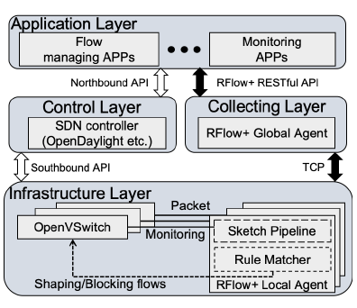

# Sketch-based Flow Monitoring and Management for SDN-based WLAN
This is an implementation of network traffic monitoring framework based on RFLOW+ published in INFOCOM 2017.
https://ieeexplore.ieee.org/stamp/stamp.jsp?arnumber=8056995

# Current Version (Extentions)

The current version, based on the previously work, focus on addressing the potential threats of an SDN-enabled WLAN device that is deployed in the wild environment. We showed that CSE sketch could perform online multi-tenant cardinality measurement with a minimum modification, which can be used to detect a flow table overflow attack in an open setting. We show a pipeline design of multiple sketches to support per-flow monitoring and multi-tenant spread detection at the same time. The current implementation can be cross-compiled and installed in an off-the-shelf access point hardware (TPLink AC1750, OpenWrt) to perform flow-level monitoring and management with low CPU and memory overheads. 

# Abstract
In this work, we propose an SDN-based WLAN flow-level monitoring and management framework called RFlow+ to enhance the WiFi management functionalities that focus only on 802.11-based information and perform coarse user-level operations. Our observation is that the WLAN service dissatisfaction is caused by the lacking of finegrained network traffic monitoring and the absence of timely network treatments. To resolve these issues, we devise an SDN-based two-level per-flow monitoring and management mechanism using a compact data structure (i.e., sketch), to handle immediate actions based on short-term (e.g., 50 ms) flow monitoring and eventual actions based on long-term (e.g., one month) flow monitoring. Moreover, to overcome threats from the flow table overflow attacks in a resource-constrained device (e.g., WLAN device) and in a timely manner, we propose an online decodable sketch-based multi-tenant cardinality measurement algorithm to protect WLAN SDN devices in the wild. To support per-flow monitoring and spread detection simultaneou sly, we designed a sketch pipeline and further prototype our framework in an off-the-shelf device. Through extensive experiments, we showed the feasibility of RFlow+ in terms of measurement/detection accuracy and overheads.

# Architecture

